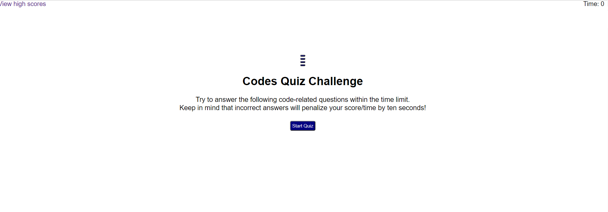

# code-quiz

A combination of multiple-choice questions and interactive challenges. For this challenge, a timed code quiz that's made up of multiple-choice questions.

### [Deployed Application](https://nlimbu07.github.io/code-quiz/)

## Description

A typical coding assessment is a combination of multiple-choice questions and interactive coding challenges.

## Build With

- HTML
- CSS
- JavaScript

## User Story

AS A coding boot camp student
I WANT to take a timed quiz on JavaScript fundamentals that stores high scores
SO THAT I can gauge my progress compared to my peers

## Acceptance Criteria

- GIVEN I am taking a code quiz
- WHEN I click the start button
- THEN a timer starts and I am presented with a question
- WHEN I answer a question
- THEN I am presented with another question
- WHEN I answer a question incorrectly
- THEN time is subtracted from the clock
- WHEN all questions are answered or the timer reaches 0
- THEN the game is over
- WHEN the game is over
- THEN I can save my initials and score
